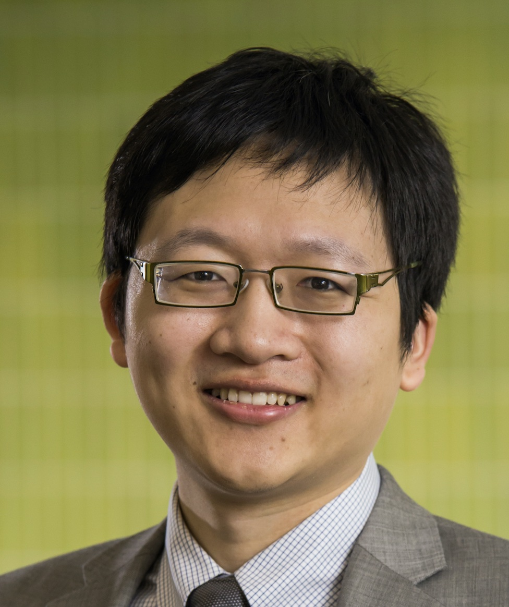

== Principle Investigator

|  | Minjie Chen \n
Associate Professor \n
217 Andlinger Center \n
609-258-7656 \n
[minjie@princeton.edu] \n |

{}{img_left}{files/minjie_new.jpg}{Portrait of Minjie Chen}{300px}{}{}
Minjie Chen \n
Associate Professor \n
217 Andlinger Center \n
609-258-7656 \n
[minjie@princeton.edu] \n

[https://ece.princeton.edu/ Department of Electrical and Computer Engineering] \n
[http://acee.princeton.edu/ Andlinger Center for Energy and the Environment] \n
[http://www.princeton.edu/main/ Princeton University] \n

You can find my [https://scholar.google.com/citations?user=ECMrftkAAAAJ&hl=en Google Scholar Page] \& [files/minjie_cv.pdf CV] here.

Here is a brief [files/powerlabposter.pdf OVERVIEW] of the research in our group.

Recent [highlights.html HIGHLIGHTS] of the research in our group.

== Current Members

{}{img_left}{files/kang.jpg}{Gyeong-Gu Kang}{100px}{}{}
Gyeong-Gu Kang \n
Postdoc Researcher \n
[gk3021@princeton.edu gk3021@princeton.edu] \n
Power Architecture, Power Management Integrated Circuits \n
From: KAIST

{}{img_left}{files/haoran_portrait.jpg}{Haoran Li}{100px}{}{}
Haoran Li \n
Postdoc Research Associate \n
[haoranli@princeton.edu haoranli@princeton.edu] \n
Machine Learning and Magnetics Modeling \n
From: Tsinghua University

{}{img_left}{files/daniel_portrait.jpg}{Daniel Zhou}{100px}{}{}
Daniel Zhou \n
Graduate Student \n
[dz8@princeton.edu dz8@princeton.edu] \n
Advanced Control and Novel Magnetic Structures \n
From: University of Waterloo

{}{img_left}{files/mian_portrait.jpg}{Mian Liao}{100px}{}{}
Mian Liao \n
Graduate Student \n
[mianl@princeton.edu mianl@princeton.edu] \n
Machine Learning and Control of Power Electronics \n
From: Virginia Tech

{}{img_left}{files/tanuj_portrait.jpg}{Tanuj Sen}{100px}{}{}
Tanuj Sen \n
Graduate Student \n
[tsen@princeton.edu  tsen@princeton.edu] \n
High Power Radio Frequency Power Electronics \n
From: ETH Zurich \& BITS Pilani

{}{img_left}{files/hsin_portrait.jpg}{Hsin Cheng}{100px}{}{}
Hsin Cheng \n
Graduate Student \n
[hsin@princeton.edu hsin@princeton.edu] \n
Power Electronics Topologies and Digital Power Architecture \n
From: National Taiwan University

{}{img_left}{files/shukai_portrait.jpg}{Shukai Wang}{100px}{}{}
Shukai Wang \n
Graduate Student \n
[sw0123@princeton.edu sw0123@princeton.edu] \n
Data Driven Methods for Power Electronics \n
From: Michigan State University

{}{img_left}{files/manos.jpg}{Konstantinos Manos}{100px}{}{}
Konstantinos Manos \n
Graduate Student \n
[km4382@princeton.edu km4382@princeton.edu] \n
Motor Drive and Power Electronics \n
From: National Technical University of Athens

{}{img_left}{files/davit.jpg}{Davit Grigoryan}{100px}{}{}
Davit Grigoryan \n
Graduate Student \n
[dg1210@princeton.edu dg1210@princeton.edu] \n
Advanced Characterization of Power Materials \n
From: University of Manchester

{}{img_left}{files/elias.jpg}{Elias Veilleux}{100px}{}{}
Elias Veilleux \n
Graduate Student \n
[ev4742@princeton.edu ev4742@princeton.edu] \n
Data Driven Methods for Power Electronics \n
From: Bates College

{}{img_left}{files/hyukjae.jpg}{Hyukjae Kwon}{100px}{}{}
Hyukjae Kwon \n
Graduate Student \n
[hk1715@princeton.edu hk1715@princeton.edu.edu] \n
High Frequency Power Electronics \n
From: Seoul National University

== Graduate Alumni

Wenliang Zneg, Postdoc Research Associate, Princeton '25 \n
Start Job: Research Scientist, University of Macau \n

Youssef Elasser, Graduate Student, Princeton '24 \n
Start Job: Senior Scientist, Nvidia Research \n

Ping Wang, Graduate Student, Princeton '23 \n
Start Job: Power Electronics Lead, Huawei Digital Energy \n

Yufei Li, Postdoc Research Associate, Princeton '23 \n
Start Job: Associate Professor, Xi'an Jiaotong University \n

Diego Serrano, Postdoc Research Associate, Princeton '22 \n
Start Job: Senior Engineer, Wolfspeed \n

Jaeil Baek, Postdoc Research Associate, Princeton '22 \n
Start Job: Analog Design Engineer, Intel \n

Yenan Chen, Postdoc Research Associate, Princeton '21 \n
Start Job: Assistant Professor, Zhejiang University \n

Ming Liu, Postdoc Research Associate, Princeton '20 \n
Start Job: Associate Professor, Shanghai Jiaotong University \n

Jing Yuan, Visiting Graduate Student, Princeton '19 \n
Start Job: System Engineer, Schneider Electric \n

Yueshi Guan, Visiting Graduate Student, Princeton '18 \n
Start Job: Associate Professor, Harbin Institute of Technology \n

== Group Photos

{}{img_left}{files/mediterra.jpg}{Mediterra 2024}{400px}{}{}
Youssef graduation group dinner at Mediterra \n

{}{img_left}{files/mediterra.jpg}{Mediterra 2024}{400px}{}{}
Youssef graduation group dinner at Mediterra \n

{}{img_left}{files/panasonic.jpg}{Panasonic 2024}{400px}{}{}
Panasonic (Ken, Kevin, Toru) visited Chen Group \n

{}{img_left}{files/conor.jpg}{ConorVisit 2024}{400px}{}{}
Dr. Conor Quinn visited Chen Group \n

{}{img_left}{files/soccer.jpg}{Chen Soccer Club 2024}{400px}{}{}
Chen Group soccer group meeting \n

{}{img_left}{files/tksdinner.jpg}{Chen Group Dinner}{400px}{}{}
Chen Group thanksgiving dinner 2023 \n

{}{img_left}{files/kpsvbook.jpg}{KPSV Book}{400px}{}{}
With Principles of Power Electronics textbook writers \n

{}{img_left}{files/huawang.jpg}{HuaWang 2023}{400px}{}{}
With Prof. Hua Wang at ETH Zurich \n

{}{img_left}{files/pingminjie.jpg}{PingMinjie 2023}{400px}{}{}
Celebrate Ping's Graduation \n

{}{img_left}{files/apec2023.jpg}{APEC 2023}{400px}{}{}
At APEC 2023 with Pilawa and Kolar groups \n

{}{img_left}{files/jgk2023.jpg}{JGK APEC 2023}{400px}{}{}
Reunion with Prof. Kassakian at APEC 2023 \n

{}{img_left}{files/yenangroup.jpg}{YenanGroup 2022}{400px}{}{}
Yenan Chen completed his postdoc training at Princeton \n

{}{img_left}{files/mittalk.jpg}{MIT Talk 2022}{400px}{}{}
Presentation at MIT after 5 years\n

{}{img_left}{files/djpmit.jpg}{MIT Trip 2022}{400px}{}{}
Reunion with Prof. Perreault at MIT \n

{}{img_left}{files/intelvisit.jpg}{Intel Trip 2022}{400px}{}{}
Visit Intel AZ with Prof. Sullivan and Youssef Elasser \n

{}{img_left}{files/diegodinner.jpg}{Diego Dinner 2022}{400px}{}{}
Group Lunch at Brick House, Go Spain! \n

{}{img_left}{files/minjiediego.jpg}{Diego Minjie 2022}{400px}{}{}
Diego's Farewell Group Lunch \n

{}{img_left}{files/mantooth.jpg}{Alan 2022}{400px}{}{}
Prof. Mantooth at Princeton \n

{}{img_left}{files/ethz.jpg}{ETH 2022}{400px}{}{}
Prof. Kolar at ETH Zurich \n

{}{img_left}{files/boulder.jpg}{Boulder 2022}{400px}{}{}
Prof. Maksimovic at Boulder \n

{}{img_left}{files/epfl.jpg}{EPFL 2022}{400px}{}{}
Prof. Dujic at EPFL \n

{}{img_left}{files/huai.jpg}{Huai 2022}{400px}{}{}
Huai at Aalborg \n

{}{img_left}{files/cindy.jpg}{Cindy 2022}{400px}{}{}
Cindy and Petru at ECE final thesis presentation \n

{}{img_left}{files/sanders.jpg}{Seth 2022}{400px}{}{}
Prof. Sanders at Princeton \n

{}{img_left}{files/kilby.jpg}{Kilby 2022}{400px}{}{}
Youssef at TI headquarter \n

{}{img_left}{files/morisushi.jpg}{Sushi 2022}{400px}{}{}
Jaeil Farewell at Mori Sushi \n
Haoran Li, Minjie Chen, Jaeil Baek, Shukai Wang, Ping Wang, Hsin Cheng, Diego Serrano, Daniel Zhou, Youssef Elasser.

{}{img_left}{files/jaeil.jpg}{APEC 2022}{400px}{}{}
Farewell meeting with Jaeil 2022 \n

{}{img_left}{files/apec2022.jpg}{APEC 2022}{400px}{}{}
APEC 2022 in Houston \n
Youssef Elasser, Minjie Chen, Daniel Zhou, Hsin Cheng, Diego Serrano, Ping Wang, and Haoran Li.

{}{img_left}{files/yenanairport.jpg}{Yenan Airport 2021}{400px}{}{}
Yenan Farewell at the JFK Airport 2021 \n
Yenan Chen and Minjie Chen.

{}{img_left}{files/pwrsoc.jpg}{PwrSoC 2021}{400px}{}{}
Group Photo at PwrSoC 2021 \n
Minjie Chen, Prof. Jason Stauth (Dartmouth), Daniel Zhou, Jaeil Baek, Ping Wang, Haoran Li, Youssef Elasser, and Diego Serrano Lopez (taking photo).

{}{img_left}{files/krein.jpg}{Krein 2021}{400px}{}{}
With Prof. Krein at Princeton \n

{}{img_left}{files/beach.jpg}{Group Photo at the Casino Pier Breakwater Beach}{400px}{}{}
Group Photo at the Casino Pier Beach 2021 \n
Minjie Chen, Daniel Zhou, Youssef Elasser, Haoran Li, Mian Liao, Hsin Cheng, Evan Dogariu, Ping Wang, Jaeil Baek, Yenan Chen

{}{img_left}{files/tardis.jpg}{Group Dinner at Tardi's Ristorante Italiano}{400px}{}{}
Group Dinner at Tardi's Ristorante Italiano 2021 \n
Yenan Chen, Evan Dogariu, Youssef Elasser, Hsin Cheng, Haoran Li, Ping Wang, Daniel Zhou, Minjie Chen, Jaeil Baek, Mian Liao

{}{img_left}{files/mingliu.jpg}{Group Photo at ECCE 2019}{400px}{}{}
Farewell Meeting with Ming 2020 \n
Ming Liu, Minjie Chen

{}{img_left}{files/lees2019.jpg}{Group Photo at ECCE 2019}{400px}{}{}
LEES Legacy Group Photo at ECCE 2019 \n

{}{img_left}{files/group.jpg}{Group Photo at ECCE 2019}{400px}{}{}
Group Photo at ECCE 2019 \n
Jing Yuan, Jaeil Baek, Youssef Elasser, Yenan Chen, Ping Wang, Ming Liu, Minjie Chen

{}{img_left}{files/bluefishgrill_2019.jpg}{Group Dinner at Bluefish Grill 2019}{400px}{}{}
Group Dinner at Bluefish Grill 2019 \n
Minjie Chen, Ming Liu, Jaeil Baek, Youssef Elasser, Yenan Chen, Ping Wang

{}{img_left}{files/ocp_2019_group.jpg}{Attending Open Compute Project at San Jose 2019}{400px}{}{}
Open Compute Project Global Summit 2019 \n
Yenan Chen, Ping Wang and Minjie Chen

{}{img_left}{files/hpcomputing_2018.jpg}{Visiting Princeton High Performance Computing Center 2018}{400px}{}{}
Princeton High Performance Computing Center 2018 \n
Ping Wang, Youssef Elasser, Parker Kushima, Ming Liu, Yueshi Guan, Minjie Chen and Yenan Chen

{}{img_left}{files/group_dinner_2018.jpg}{New Year Group Dinner at Root 2018}{400px}{}{}
New Year Group Dinner at Root 2018 \n
Ping Wang, Fida Newaj, Ming Liu, Yueshi Guan, Minjie Chen and Yao Shen

{}{img_left}{files/drone_project_2017.jpg}{Testing Drones in Forbes 2017}{400px}{}{}
Testing Drones in the backyard of Forbes 2017 \n
Abdulghafar Al Tair, Alex Ju, Fida Newaj
