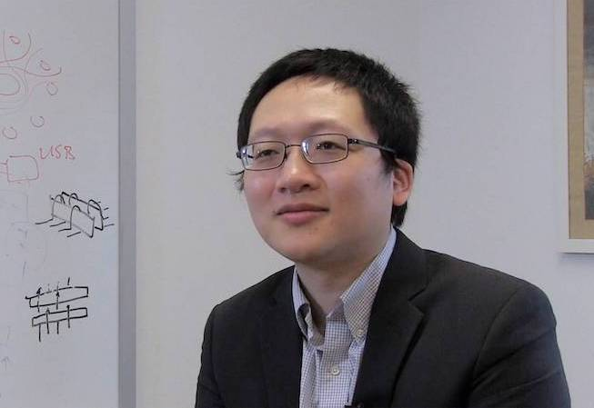

## Principle Investigator

{:style="float: left;margin-right: 20px;:class="img-responsive"}
[Prof. Minjie Chen](https://scholar.google.com/citations?user=ECMrftkAAAAJ&hl=en)  
Associate Professor  
[Electrical and Computer Engineering](https://ece.princeton.edu/)  
[Andlinger Center for Energy and the Environment](https://acee.princeton.edu/)  
[Princeton University](https://www.princeton.edu/)  
ACEE 217, 86 Olden Street, Princeton NJ, 08540  
[minjie@princeton.edu](mailto:minjie@princeton.edu)  
+1 609-258-7656  

## Current Students

{:style="float: left;margin-right: 20px;:class="img-responsive"}
[Dr. Gyeong-Gu Kang](https://scholar.google.com/citations?user=5zSfb3YAAAAJ&hl=en)  
Postdoc Research Associate  
[gk3021@princeton.edu](mailto:gk3021@princeton.edu)  
Power Architecture  
Power Management Integrated Circuits  
From: KAIST  

{:style="float: left;margin-right: 20px;:class="img-responsive"}
[Dr. Yifan Rao](https://scholar.google.com/citations?user=oJ52VF4AAAAJ&hl=en)  
Postdoc Research Associate  
[yifan.rao@princeton.edu](mailto:yifan.rao@princeton.edu)  
Advanced Materials  
Robotic Systems  
From: UT Austin  

{:style="float: left;margin-right: 20px;:class="img-responsive"}
[Dr. Daniel Zhou](https://scholar.google.com/citations?user=HdpEOSoAAAAJ&hl=en)  
Postdoc Research Associate  
[dz8@princeton.edu](mailto:dz8@princeton.edu)  
Advanced Control and Magnetics  
Utra-fast Power Electronics  
From: University of Waterloo  

{:style="float: left;margin-right: 20px;:class="img-responsive"}
[Mian Liao](https://scholar.google.com/citations?user=k6W4g7AAAAAJ&hl=en)  
Graduate Student  
[mianl@princeton.edu](mailto:mianl@princeton.edu)  
Machine Learning in Power Electronics  
Grid Interface Power Electronics  
From: Virginia Tech  

{:style="float: left;margin-right: 20px;:class="img-responsive"}
[Tanuj Sen](https://scholar.google.com/citations?user=ayF8QoYAAAAJ&hl=en)  
Graduate Student  
[tsen@princeton.edu](mailto:tsen@princeton.edu)  
Grid Interface and RF Power Electronics  
Sustainable Power Electronics  
From: ETH Zurich  

{:style="float: left;margin-right: 20px;:class="img-responsive"}
[Hsin Cheng](https://scholar.google.com/citations?user=YpbgNM8AAAAJ&hl=en)  
Graduate Student  
[hsin@princeton.edu](mailto:hsin@princeton.edu)  
Robotics Power Architecture  
Soft Robotics  
From: National Taiwan University  

{:style="float: left;margin-right: 20px;:class="img-responsive"}
[Shukai Wang](https://scholar.google.com/citations?user=bITUZKkAAAAJ&hl=en)  
Graduate Student  
[sw0123@princeton.edu](mailto:sw0123@princeton.edu)  
Data Driven Methods and Power Magnetics  
Pulsed Power Electronics  
From: Michigan State University  

{:style="float: left;margin-right: 20px;:class="img-responsive"}
[Konstantinos Manos](https://scholar.google.com/citations?user=y_FThwgAAAAJ&hl=en)  
Graduate Student  
[km4382@princeton.edu](mailto:km4382@princeton.edu)  
Motor Drive and Power Electronics  
Robotics and Smart Structures  
From: National Technical University of Athens  

{:style="float: left;margin-right: 20px;:class="img-responsive"}
[Davit Grigoryan](https://scholar.google.com/citations?user=twna1dwAAAAJ&hl=en)  
Graduate Student  
[dg1210@princeton.edu](mailto:dg1210@princeton.edu)  
Power Materials  
Grid Interface and RF Power Electronics  
From: University of Manchester  

{:style="float: left;margin-right: 20px;:class="img-responsive"}
[Elias Veilleux]()  
Graduate Student  
[ev4742@princeton.edu](mailto:ev4742@princeton.edu)  
Data Driven Methods  
Robotics and Power Electronics  
From: Bates College  

{:style="float: left;margin-right: 20px;:class="img-responsive"}
[Hyukjae Kwon](https://scholar.google.com/citations?user=uTettKIAAAAJ&hl=en)  
Graduate Student  
[hk1715@princeton.edu](mailto:hk1715@princeton.edu)  
High Frequency Power Electronics  
Power Magnetics Modeling  
From: Seoul National University  

## Alumni

- [Haoran Li](https://scholar.google.com/citations?user=hVH03bUAAAAJ&hl=en), Postdoctoral Researcher, Princeton, [PhD Thesis](https://dataspace.princeton.edu/handle/88435/dsp01tq57nv50z)
- [Youssef Elasser](https://scholar.google.com/citations?user=VdbaC-oAAAAJ&hl=en), Research Scientist, Nvidia, [PhD Thesis](https://dataspace.princeton.edu/handle/88435/dsp01r781wk40r)
- [Ping Wang](https://scholar.google.com/citations?user=ruSwnUoAAAAJ&hl=en), Assistant Professor, HKUST, [PhD Thesis](https://dataspace.princeton.edu/handle/88435/dsp01sn00b202c)
- [Wenliang Zeng](https://scholar.google.com/citations?user=Bz8EENAAAAAJ&hl=zh-CN), Assistant Professor, University of Macau, [Postdoc Paper](https://ieeexplore.ieee.org/abstract/document/11121243)
- [Yufei Li](https://scholar.google.com/citations?user=wuYiLJYAAAAJ&hl=en), Professor, Xi'an Jiaotong University, [Postdoc Paper](https://ieeexplore.ieee.org/abstract/document/10529635/)
- [Diego Serrano](https://scholar.google.com/citations?user=9d3MiNwAAAAJ&hl=es), Senior Engineer, Wolfspeed, [Postdoc Paper](https://ieeexplore.ieee.org/abstract/document/10169101)
- [Jaeil Baek](https://scholar.google.com/citations?user=gkX2K-gAAAAJ&hl=en), Assistant Professor, KAIST, [Postdoc Paper](https://ieeexplore.ieee.org/abstract/document/9650554/)
- [Yenan Chen](https://scholar.google.com/citations?user=emCURHIAAAAJ&hl=zh-CN), Professor, Zhejiang University, [Postdoc Paper](https://ieeexplore.ieee.org/abstract/document/9097920)
- [Ming Liu](https://scholar.google.com/citations?user=h5UzZUYAAAAJ&hl=en), Professor, Shanghai Jiaotong University, [Postdoc Paper](https://ieeexplore.ieee.org/abstract/document/8701672)

## Visitors

- [Hans Wouters](https://scholar.google.com/citations?user=OnxP6MYAAAAJ&hl=en), KU Leuven, Princeton’25
- [Hanyu Liu](https://ieeexplore.ieee.org/author/37088542632), Tsinghua U., Princeton’24
- [Yang Wu](https://scholar.google.com/citations?user=7kgAUr4AAAAJ&hl=en), TU Delft, Princeton’23
- [Jing Yuan](https://scholar.google.com/citations?user=a1kBZ8kAAAAJ&hl=en), Aalborg U., Princeton’19
- [Yueshi Guan](https://scholar.google.com/citations?user=Csq-f_AAAAAJ&hl=en), HIT, Princeton’18

## Friendship

